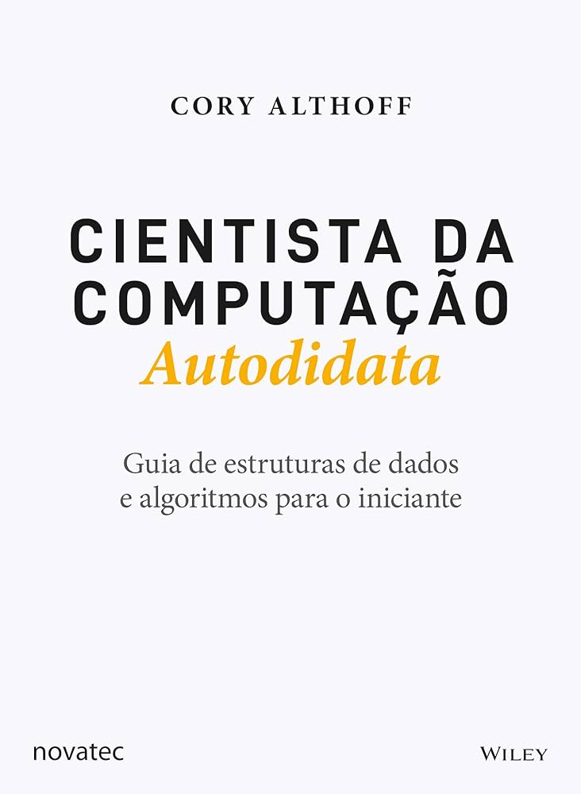

# Data Structure (in progress)

## Repository dedicated to helping those who are starting out in programming, or need to review and reinforce their knowledge with data structures.

## Most of the examples presented were based on the books: Self-Taught Computer Scientist, by Cory Althoff, and Python and Django, by Francisco Marcelo.

, 

## Ordination:

### A sorting algorithm is a set of instructions or rules designed to organize elements into a specific order. Typically, these elements are  provided in a list, array, or sequence, and the ordering can be either ascending or descending, depending on the requirements.

### There are various sorting algorithms, each with its own characteristics and efficiency in different scenarios. Some of the most common sorting algorithms include:

### Bubble Sort: Compares adjacent elements and swaps them if they are in the wrong order, repeating this process until the list is sorted.

### Insertion Sort: Builds a sorted sequence of elements one at a time by taking each element and inserting it into the correct position.

### Selection Sort: Finds the smallest element in the list and places it in the first position, then finds the second smallest element and places it in the second position, and so on.

### Merge Sort: Divides the list into halves, sorts each half, and then merges the two sorted halves to obtain the final sorted list.

### Quick Sort: Selects an element as the "pivot" and rearranges the other elements relative to it by partitioning the list into two parts. This process is applied recursively to the remaining parts.

### The choice of a sorting algorithm depends on factors such as the size of the list, the desired efficiency, and other specifics of the problem at hand. Sorting algorithms are fundamental in computer science and find widespread use in various applications for efficiently organizing data.

## Recursion

### Recursion is a programming concept where a function calls itself in order to solve a problem. Instead of using iteration (loops) to repeatedly execute a set of statements, a recursive function breaks down a problem into smaller, more manageable subproblems and solves each subproblem by invoking the same function. The process continues until a base case is reached, at which point the function returns a result without making further recursive calls.

### Key components of a recursive function include:

### Base Case: This is the condition that determines when the recursion should stop. It represents the simplest form of the problem that can be directly solved without further recursion.

### Recursive Case: This is where the function calls itself with a modified version of the original problem. The goal is to reduce the problem toward the base case.

### A classic example of recursion is the computation of the factorial of a number. The factorial of a non-negative integer nn, denoted as n!n!, is the product of all positive integers up to nn. 

## Search

### Linear Search:
### Sequentially searches through a list of elements until the desired element is found.
### Simple but can be inefficient for large datasets.

### Binary Search:
### Works only on sorted lists.
### Compares the target element with the middle element of the list and eliminates half of the elements in each iteration.
### Very efficient for large sorted datasets.
###
### Depth-First Search (DFS):
### Used to explore graphs and trees.
### Starts at a node and explores as far as possible before backtracking.
### Can be implemented recursively.

### Breadth-First Search (BFS):
### Another algorithm for graph and tree traversal.
### Starts at a node and explores all its neighbors before moving on to the neighbors' neighbors.
### Typically implemented using a queue.

### A Algorithm:*
### Used in pathfinding problems in graphs, such as finding the shortest path from one point to another.
### Combines breadth-first search with a heuristic to prioritize certain paths.
### Very efficient for pathfinding problems.

### Depth-Limited Search (DLS):
### Similar to depth-first search but limits the depth of exploration.
### Prevents problems with unlimited depth in depth-first search.

### Bidirectional Search:
### Conducts simultaneous searches from the initial and final states, seeking a meeting point.
### Can be more efficient in some cases compared to unidirectional search.

### Each search algorithm has its own strengths and weaknesses, and the choice of the best algorithm depends on the specific context of the problem being solved.

## String

### String Search Algorithm:
### Finding the occurrence of a pattern in a string.
### Examples include algorithms like Naive Search, Knuth-Morris-Pratt (KMP) Algorithm, and Boyer-Moore Algorithm.

### Longest Common Subsequence (LCS) Algorithm:
### Finding the longest common subsequence between two sequences.
## Can be used to compare similarities between two strings.

### Edit Distance Algorithm:
### Measuring the difference between two strings, represented by the minimum number of edit operations (insertion, removal, substitution) needed to convert one string into another.
### The Wagner-Fisher algorithm is an example.

### Rabin-Karp Algorithm:
### Used to find patterns in text.
### Utilizes hash functions to quickly check if a pattern occurs at a particular position in the string.

### Knuth-Morris-Pratt (KMP) Algorithm:
### An efficient pattern-searching algorithm.
### Uses precomputed information about the pattern to avoid unnecessary comparisons.

### Boyer-Moore Algorithm:
### Another efficient pattern-searching algorithm.
### Explores information about the last occurrence of each character in the pattern to skip sections of the input string during the search.

## Data Compression Algorithm (e.g., Lempel-Ziv-Welch):
## Reducing the size of a string by representing repetitions of substrings with shorter codes.
## Used in data compression.

## Manacher's Algorithm:
## Finding the longest palindromic substring in a string.
## Efficient for finding all palindromes in a string.

## These algorithms play crucial roles in various applications, from pattern searching to data compression and natural language processing. The choice of the algorithm depends on the specific requirements of the problem at hand.

### >>> Mathematics
### >>> Arrays
### >>> Lists
### >>> Stacks
### >>> Queues
### >>> Hash Table
### >>> Binary Tree
### >>> Binary Heap
### >>> Graphs

